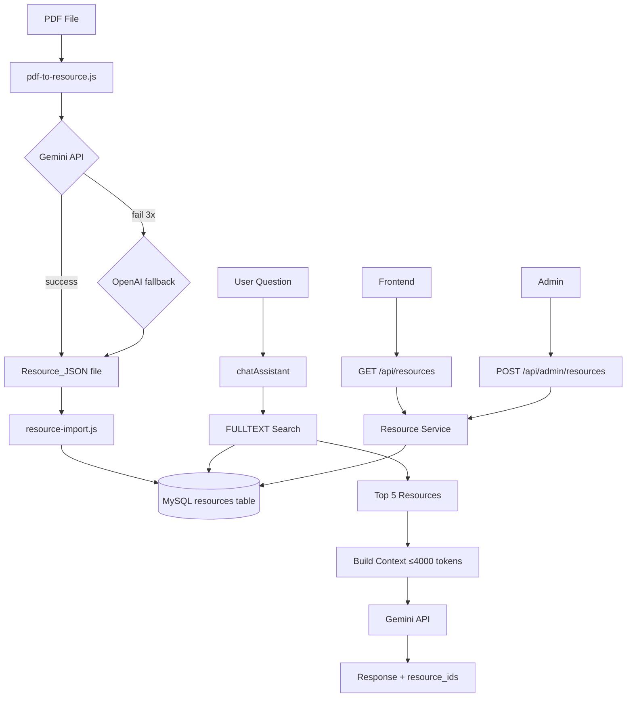

# Design Document: Learning Resource Library

## Overview

Learning Resource Library mở rộng nền tảng E-Master bằng cách xây dựng một thư viện tài liệu học tập có cấu trúc, hỗ trợ pipeline PDF → JSON → DB, hệ thống phân loại đa chiều (taxonomy), REST API query/filter, và tích hợp AI chatbot thông qua MySQL FULLTEXT search.

Tính năng này hoàn toàn tách biệt với pipeline đề thi hiện có (`pdf-to-test.js` / `pdf-import.js`) và sử dụng bảng `resources` đã có, mở rộng thêm cột `exam_type`, `topic` và FULLTEXT index.

**Nguyên tắc thiết kế:**
- Tái sử dụng pattern đã có: `pdf-to-test.js` → `pdf-to-resource.js`, `pdf-import.js` → `resource-import.js`
- Không phá vỡ dữ liệu hiện có trong bảng `resources`
- AI chatbot tích hợp qua FULLTEXT search, không cần vector DB
- Bilingual content (EN + VI) lưu trong cùng một bản ghi

---

## Architecture



**Luồng dữ liệu chính:**
1. **Ingestion**: PDF → AI parse → Resource_JSON → DB (offline scripts)
2. **Query**: Frontend → REST API → Resource Service → MySQL
3. **AI Chat**: User message → FULLTEXT search → context building → Gemini → response

---

## Components and Interfaces

### 1. Resource JSON Schema (`resource-schema.js`)

Module validation dùng chung cho cả parser và importer.

```javascript
// Enums
const RESOURCE_TYPES = ['grammar_rule', 'vocabulary', 'ielts_tip', 'toeic_tip', 'reference', 'example', 'template', 'article'];
const SKILLS = ['reading', 'listening', 'writing', 'speaking', 'vocabulary', 'grammar', 'general'];
const EXAM_TYPES = ['IELTS', 'TOEIC', 'general'];

// Resource_JSON structure
{
  title: string,                    // required
  language: 'en' | 'vi' | 'both',  // required
  content: {                        // required
    en: string,                     // required, non-empty
    vi: string | null               // optional
  },
  taxonomy: {                       // required
    exam_type: EXAM_TYPES,          // required
    skill: SKILLS,                  // required
    resource_type: RESOURCE_TYPES,  // required
    level: string | null,
    topic: string | null,
    tags: string[]                  // max 20 items
  },
  summary: string | null,           // optional, auto-generated if absent
  metadata: {                       // optional
    source: string,
    author: string,
    word_count: number,
    estimated_read_minutes: number
  } | null
}
```

**Interface `validateResourceJSON(obj)`:**
- Returns `{ valid: true }` hoặc `{ valid: false, errors: string[] }`
- Errors phải chứa tên trường bị thiếu/sai

### 2. Script `pdf-to-resource.js`

Tương tự `pdf-to-test.js` nhưng output là Resource_JSON.

**CLI:**
```
node scripts/pdf-to-resource.js \
  --pdf <path>          # required
  --type <resource_type>  # optional, AI infers if absent
  --skill <skill>         # optional
  --exam <exam_type>      # optional
  --out <path>            # default: generated-resources/
  --dry                   # print to stdout, no file write
```

**Xử lý chunking:** Nếu PDF text > 28.000 ký tự, chia thành chunks và merge kết quả (tương tự `processReadingInChunks`).

**Retry logic:** Giống `callGemini` trong `ai.service.js` — 3 lần, delay 15s/30s/45s cho 429/503. Fallback sang OpenAI nếu có `OPENAI_API_KEY`.

**Prompt template** yêu cầu AI trả về Resource_JSON schema, tự suy luận taxonomy nếu không có CLI args.

### 3. Script `resource-import.js`

Tương tự `pdf-import.js` nhưng import vào bảng `resources`.

**CLI:**
```
node scripts/resource-import.js \
  --file <path.json>    # single file
  --dir <directory>     # all *.json in dir
  --dry                 # validate only, no DB write
```

**Upsert key:** `title` + `resource_type` + `skill` (composite)

**Field mapping:**

| Resource_JSON field | DB column |
|---|---|
| `title` | `title` |
| `content` (object) | `content` (JSON string) |
| `summary` | `summary` (auto-gen nếu null) |
| `taxonomy.skill` | `skill` |
| `taxonomy.resource_type` | `resource_type` |
| `taxonomy.level` | `level` |
| `taxonomy.tags` | `tags` |
| `taxonomy.exam_type` | `exam_type` (new column) |
| `taxonomy.topic` | `topic` (new column) |
| `metadata` | `metadata` (merged) |

**Auto-summary:** Nếu `summary` null, lấy 500 ký tự đầu của `content.en`.

### 4. Migration: `add-resource-taxonomy-fields.js`

```javascript
// Thêm 2 cột mới + FULLTEXT index
await queryInterface.addColumn('resources', 'exam_type', {
  type: Sequelize.STRING(20), allowNull: true, after: 'resource_type'
});
await queryInterface.addColumn('resources', 'topic', {
  type: Sequelize.STRING(100), allowNull: true, after: 'exam_type'
});
// FULLTEXT index (raw SQL vì Sequelize không hỗ trợ trực tiếp)
await queryInterface.sequelize.query(
  'ALTER TABLE resources ADD FULLTEXT INDEX ft_resources_search (title, content, summary, keywords)'
);
```

Migration an toàn: chỉ `addColumn` và `addIndex`, không xóa/sửa dữ liệu hiện có.

### 5. Resource Model (cập nhật)

Thêm 2 field mới vào `resource.model.js`:
- `exam_type`: `DataTypes.STRING(20)`, allowNull: true
- `topic`: `DataTypes.STRING(100)`, allowNull: true

Cập nhật `resource_type` từ ENUM sang `DataTypes.STRING(50)` để hỗ trợ các giá trị mới (`ielts_tip`, `toeic_tip`, `reference`, `article`).

### 6. Resource Service (mở rộng)

Thêm các method mới vào `resource.service.js`:

```javascript
// FULLTEXT search với relevance score
async function fulltextSearch(query, filters, pagination)
// Returns: { resources, total, page, limit }

// Filter đa chiều
async function filterResources(filters, pagination, sort)
// filters: { exam_type, skill, resource_type, level, topic, tags, is_active, is_featured }
// sort: 'newest' | 'popular' | 'rating' | 'relevance'

// Taxonomy values
async function getTaxonomyValues()
// Returns distinct values for all taxonomy fields

// Admin operations
async function createResource(data)
async function updateResource(id, data)
async function softDeleteResource(id)
async function toggleFeatured(id)
```

**FULLTEXT search query:**
```sql
SELECT *, MATCH(title, content, summary, keywords) AGAINST(? IN BOOLEAN MODE) AS score
FROM resources
WHERE is_active = 1 AND score > 0
ORDER BY score DESC
LIMIT ? OFFSET ?
```

### 7. Resource Controller (mở rộng)

Thêm endpoints mới vào `resource.controller.js`:

```javascript
// Public endpoints
exports.listResources    // GET /api/resources
exports.getResourceById  // GET /api/resources/:id (existing, update view_count)
exports.getTaxonomy      // GET /api/resources/taxonomy

// Admin endpoints
exports.createResource   // POST /api/admin/resources
exports.updateResource   // PUT /api/admin/resources/:id
exports.deleteResource   // DELETE /api/admin/resources/:id
exports.toggleFeatured   // POST /api/admin/resources/:id/feature
```

**Response format chuẩn:**
```json
{
  "success": true,
  "data": [...],
  "total": 100,
  "page": 1,
  "limit": 20,
  "pages": 5
}
```

### 8. AI Service (mở rộng `chatAssistant`)

Mở rộng function `chatAssistant` trong `ai.service.js` để tích hợp FULLTEXT search:

```javascript
async function chatAssistant(message, options = {}) {
  // 1. Extract keywords từ message
  // 2. FULLTEXT search với timeout 2s
  // 3. Build context từ top 5 resources (≤4000 tokens)
  // 4. Gọi Gemini với context
  // 5. Return { response, resource_ids }
}
```

**Context building logic:**
- Chỉ lấy `title`, `summary`, `content.en` (hoặc `content.vi` nếu message tiếng Việt)
- Đếm token ước tính: `Math.ceil(text.length / 4)`
- Dừng thêm resource khi tổng > 4000 tokens
- Nếu search timeout (>2s), tiếp tục không có context

---

## Data Models

### Bảng `resources` (sau migration)

| Column | Type | Notes |
|---|---|---|
| id | INT UNSIGNED PK | |
| title | VARCHAR(500) | |
| content | LONGTEXT | JSON string `{en, vi}` |
| summary | TEXT | Auto-generated nếu null |
| resource_type | VARCHAR(50) | Mở rộng từ ENUM |
| skill | VARCHAR(30) | |
| level | VARCHAR(50) | |
| difficulty | TINYINT | 1-5 |
| **exam_type** | **VARCHAR(20)** | **NEW: IELTS/TOEIC/general** |
| **topic** | **VARCHAR(100)** | **NEW: free-text topic** |
| tags | JSON | string[] max 20 |
| keywords | JSON | string[] |
| url | VARCHAR(1000) | |
| source | VARCHAR(255) | |
| image_url | VARCHAR(500) | |
| video_url | VARCHAR(500) | |
| view_count | INT UNSIGNED | |
| helpful_count | INT UNSIGNED | |
| unhelpful_count | INT UNSIGNED | |
| average_rating | DECIMAL(3,2) | |
| is_active | TINYINT(1) | Soft delete flag |
| is_featured | TINYINT(1) | |
| metadata | JSON | `{source, author, word_count, ...}` |
| created_at | DATETIME | |
| updated_at | DATETIME | |

**Indexes:**
- `idx_res_skill` (skill)
- `idx_res_type` (resource_type)
- `idx_res_level` (level)
- `idx_res_is_active` (is_active)
- `idx_res_is_featured` (is_featured)
- `idx_res_exam_type` (exam_type) — NEW
- `idx_res_topic` (topic) — NEW
- `ft_resources_search` FULLTEXT (title, content, summary, keywords) — NEW

### Resource_JSON Schema (file format)

```json
{
  "title": "IELTS Writing Task 2: Opinion Essays",
  "language": "both",
  "content": {
    "en": "An opinion essay requires you to...",
    "vi": "Bài luận quan điểm yêu cầu bạn..."
  },
  "taxonomy": {
    "exam_type": "IELTS",
    "skill": "writing",
    "resource_type": "ielts_tip",
    "level": "Band 6-7",
    "topic": "ielts_writing_task2",
    "tags": ["opinion", "task2", "writing", "structure"]
  },
  "summary": "Guide to writing IELTS Task 2 opinion essays with structure and examples.",
  "metadata": {
    "source": "Cambridge IELTS 15",
    "author": "Internal",
    "word_count": 850,
    "estimated_read_minutes": 5
  }
}
```

---

## Correctness Properties

*A property is a characteristic or behavior that should hold true across all valid executions of a system — essentially, a formal statement about what the system should do. Properties serve as the bridge between human-readable specifications and machine-verifiable correctness guarantees.*

### Property 1: Schema validation rejects invalid enums

*For any* Resource_JSON object where `taxonomy.resource_type`, `taxonomy.skill`, hoặc `taxonomy.exam_type` chứa giá trị nằm ngoài tập hợp hợp lệ, `validateResourceJSON` SHALL trả về `{ valid: false }` với error message chứa tên trường vi phạm.

**Validates: Requirements 1.4, 1.5, 1.6, 1.8**

### Property 2: Schema validation rejects missing required fields

*For any* Resource_JSON object thiếu bất kỳ trường bắt buộc nào trong `{ title, resource_type, skill, content, language }`, `validateResourceJSON` SHALL trả về `{ valid: false }` với error message chứa tên trường bị thiếu.

**Validates: Requirements 1.1, 1.8**

### Property 3: Content bilingual structure invariant

*For any* Resource_JSON được validate thành công, trường `content` SHALL luôn là object có key `en` (non-empty string) và key `vi` (string hoặc null).

**Validates: Requirements 1.2, 8.4**

### Property 4: Import idempotence

*For any* Resource_JSON hợp lệ, import cùng một file hai lần liên tiếp SHALL tạo ra đúng một bản ghi trong bảng `resources` (không tạo duplicate), với dữ liệu từ lần import thứ hai.

**Validates: Requirements 3.1, 3.2**

### Property 5: Import-export round trip

*For any* Resource_JSON hợp lệ, sau khi import vào DB và export lại qua `GET /api/resources/:id`, các trường `title`, `skill`, `resource_type`, `exam_type`, `content.en` SHALL có giá trị giống hệt Resource_JSON gốc.

**Validates: Requirements 3.3, 3.4, 3.5, 8.1, 8.2**

### Property 6: Auto-summary length constraint

*For any* Resource_JSON không có trường `summary`, sau khi import, bản ghi trong DB SHALL có `summary` không rỗng và độ dài không vượt quá 500 ký tự.

**Validates: Requirements 8.3**

### Property 7: Filter correctness

*For any* tập hợp filter `{ exam_type, skill, resource_type, level, topic }` được gửi tới `GET /api/resources`, tất cả resources trong response SHALL khớp với tất cả filter được cung cấp (không có resource nào trong kết quả vi phạm filter).

**Validates: Requirements 6.1**

### Property 8: Pagination consistency

*For any* tập dữ liệu và tham số `limit`, khi lấy tất cả các trang (page 1, 2, ..., n), tổng số resources trả về SHALL bằng `total` và không có resource nào xuất hiện ở hai trang khác nhau.

**Validates: Requirements 6.3**

### Property 9: Sort order correctness

*For any* danh sách resources được trả về với `sort=popular`, `view_count` của mỗi resource SHALL lớn hơn hoặc bằng `view_count` của resource tiếp theo trong danh sách.

**Validates: Requirements 6.4**

### Property 10: View count increment

*For any* resource đang active, mỗi lần gọi `GET /api/resources/:id` SHALL tăng `view_count` của resource đó đúng 1 đơn vị.

**Validates: Requirements 6.7**

### Property 11: Taxonomy endpoint completeness

*For any* giá trị `exam_type` (hoặc `skill`, `resource_type`, `level`, `topic`) tồn tại trong ít nhất một bản ghi active trong DB, giá trị đó SHALL xuất hiện trong response của `GET /api/resources/taxonomy`.

**Validates: Requirements 6.8**

### Property 12: Chatbot context size limit

*For any* câu hỏi user, context được build từ resources và gửi cho AI model SHALL có tổng độ dài không vượt quá 4.000 tokens (ước tính `length / 4`).

**Validates: Requirements 7.4**

### Property 13: Chatbot resource count limit

*For any* câu hỏi user, số lượng resources được đưa vào context SHALL không vượt quá 5.

**Validates: Requirements 7.2, 7.3**

### Property 14: Chatbot response includes resource_ids

*For any* câu hỏi user mà có ít nhất 1 resource được tìm thấy, response metadata SHALL chứa mảng `resource_ids` không rỗng với các ID tương ứng với resources đã được đưa vào context.

**Validates: Requirements 7.6**

### Property 15: Soft delete hides resource

*For any* resource, sau khi gọi `DELETE /api/admin/resources/:id`, resource đó SHALL không xuất hiện trong kết quả của `GET /api/resources` (public listing), và `is_active` SHALL bằng `false`.

**Validates: Requirements 9.3**

### Property 16: Feature toggle idempotence (round-trip)

*For any* resource, gọi `POST /api/admin/resources/:id/feature` hai lần liên tiếp SHALL trả về `is_featured` về giá trị ban đầu trước khi gọi lần đầu.

**Validates: Requirements 9.4**

### Property 17: Admin authorization enforcement

*For any* request tới các endpoint `/api/admin/resources/*` với user có `role != 'admin'`, response SHALL có HTTP status 403.

**Validates: Requirements 9.6**

### Property 18: Chunking threshold

*For any* PDF text có độ dài > 28.000 ký tự, parser SHALL chia thành ít nhất 2 chunks trước khi gọi AI API.

**Validates: Requirements 2.2**

---

## Error Handling

### Parser (`pdf-to-resource.js`)

| Tình huống | Xử lý |
|---|---|
| File PDF không tồn tại | Log lỗi, `process.exit(1)` |
| `content.en` rỗng sau parse | Log lỗi, không tạo file output, `process.exit(1)` |
| Gemini 429/503 | Retry 3 lần: 15s, 30s, 45s |
| Gemini thất bại sau 3 lần | Fallback OpenAI nếu có key, else `process.exit(1)` |
| AI trả về JSON không hợp lệ | Log raw response, `process.exit(1)` |
| Schema validation fail | Log danh sách lỗi, không ghi file |

### Importer (`resource-import.js`)

| Tình huống | Xử lý |
|---|---|
| File JSON không parse được | Skip file, log lỗi, tăng `fail` counter |
| Schema validation fail | Skip file, log lỗi cụ thể, tăng `fail` counter |
| DB connection error | Log lỗi, `process.exit(1)` |
| Upsert thất bại | Log lỗi, tăng `fail` counter, tiếp tục file tiếp theo |
| Kết thúc | In summary: `created`, `updated`, `failed` |

### API Endpoints

| Tình huống | HTTP Status | Response |
|---|---|---|
| Resource không tồn tại | 404 | `{ success: false, message: "Resource not found" }` |
| Filter không khớp | 200 | `{ success: true, data: [], total: 0 }` |
| Thiếu trường bắt buộc (POST) | 400 | `{ success: false, errors: ["title is required", ...] }` |
| Không phải admin | 403 | `{ success: false, message: "Forbidden" }` |
| DB error | 500 | `{ success: false, message: "Internal server error" }` |

### AI Chatbot

| Tình huống | Xử lý |
|---|---|
| FULLTEXT search > 2s | Timeout, tiếp tục không có context resource |
| Không có resource match | Trả lời từ kiến thức AI, `resource_ids: []` |
| Gemini fail | Retry logic hiện có trong `callGemini` |

---

## Testing Strategy

### Dual Testing Approach

Sử dụng kết hợp **unit tests** (Jest) và **property-based tests** (fast-check) để đạt coverage toàn diện.

**Unit tests** tập trung vào:
- Specific examples: import một file cụ thể, gọi endpoint với params cụ thể
- Integration points: DB upsert, API response format
- Edge cases: empty content, missing fields, non-existent IDs, non-admin access

**Property tests** tập trung vào:
- Universal properties: validation, round-trip, filter correctness, pagination
- Mỗi property test chạy tối thiểu **100 iterations**

### Property-Based Testing Library

Sử dụng **[fast-check](https://github.com/dubzzz/fast-check)** (JavaScript/TypeScript PBT library).

```bash
npm install --save-dev fast-check
```

### Property Test Mapping

Mỗi property test phải có comment tag theo format:
`// Feature: learning-resource-library, Property {N}: {property_text}`

| Property | Test file | fast-check arbitraries |
|---|---|---|
| P1: Enum validation | `resource-schema.test.js` | `fc.string()` cho invalid enums |
| P2: Required fields | `resource-schema.test.js` | `fc.record()` với missing fields |
| P3: Content structure | `resource-schema.test.js` | `fc.record()` với valid content |
| P4: Import idempotence | `resource-import.test.js` | `fc.record()` cho valid resources |
| P5: Round-trip | `resource-roundtrip.test.js` | `fc.record()` cho valid resources |
| P6: Auto-summary | `resource-import.test.js` | `fc.string({ minLength: 1 })` |
| P7: Filter correctness | `resource-api.test.js` | `fc.record()` cho filter params |
| P8: Pagination | `resource-api.test.js` | `fc.integer({ min: 1, max: 100 })` |
| P9: Sort order | `resource-api.test.js` | `fc.array()` của resources |
| P10: View count | `resource-api.test.js` | `fc.integer()` cho resource IDs |
| P11: Taxonomy completeness | `resource-api.test.js` | `fc.array()` của resources |
| P12: Context size | `ai-chatbot.test.js` | `fc.string()` cho messages |
| P13: Resource count | `ai-chatbot.test.js` | `fc.string()` cho messages |
| P14: resource_ids in response | `ai-chatbot.test.js` | `fc.string()` cho messages |
| P15: Soft delete | `resource-admin.test.js` | `fc.integer()` cho IDs |
| P16: Feature toggle | `resource-admin.test.js` | `fc.integer()` cho IDs |
| P17: Admin auth | `resource-admin.test.js` | `fc.string()` cho roles |
| P18: Chunking threshold | `pdf-to-resource.test.js` | `fc.string({ minLength: 28001 })` |

### Unit Test Examples

```javascript
// resource-schema.test.js
describe('validateResourceJSON', () => {
  it('accepts valid resource', () => { /* example */ });
  it('rejects resource with missing title', () => { /* edge case */ });
  it('rejects resource with empty content.en', () => { /* edge case */ });
  it('accepts resource without optional summary', () => { /* example */ });
});

// resource-api.test.js
describe('GET /api/resources/:id', () => {
  it('returns 404 for non-existent id', () => { /* edge case */ });
  it('returns 200 with full bilingual content', () => { /* example */ });
});

// resource-admin.test.js
describe('POST /api/admin/resources', () => {
  it('returns 400 when title is missing', () => { /* edge case */ });
  it('returns 403 for non-admin user', () => { /* edge case */ });
});
```

### Property Test Example

```javascript
const fc = require('fast-check');
const { validateResourceJSON } = require('../src/utils/resource-schema');

// Feature: learning-resource-library, Property 1: Schema validation rejects invalid enums
test('P1: enum validation rejects invalid resource_type', () => {
  fc.assert(
    fc.property(
      fc.string().filter(s => !RESOURCE_TYPES.includes(s)),
      (invalidType) => {
        const resource = makeValidResource({ taxonomy: { resource_type: invalidType } });
        const result = validateResourceJSON(resource);
        return result.valid === false && result.errors.some(e => e.includes('resource_type'));
      }
    ),
    { numRuns: 100 }
  );
});
```
